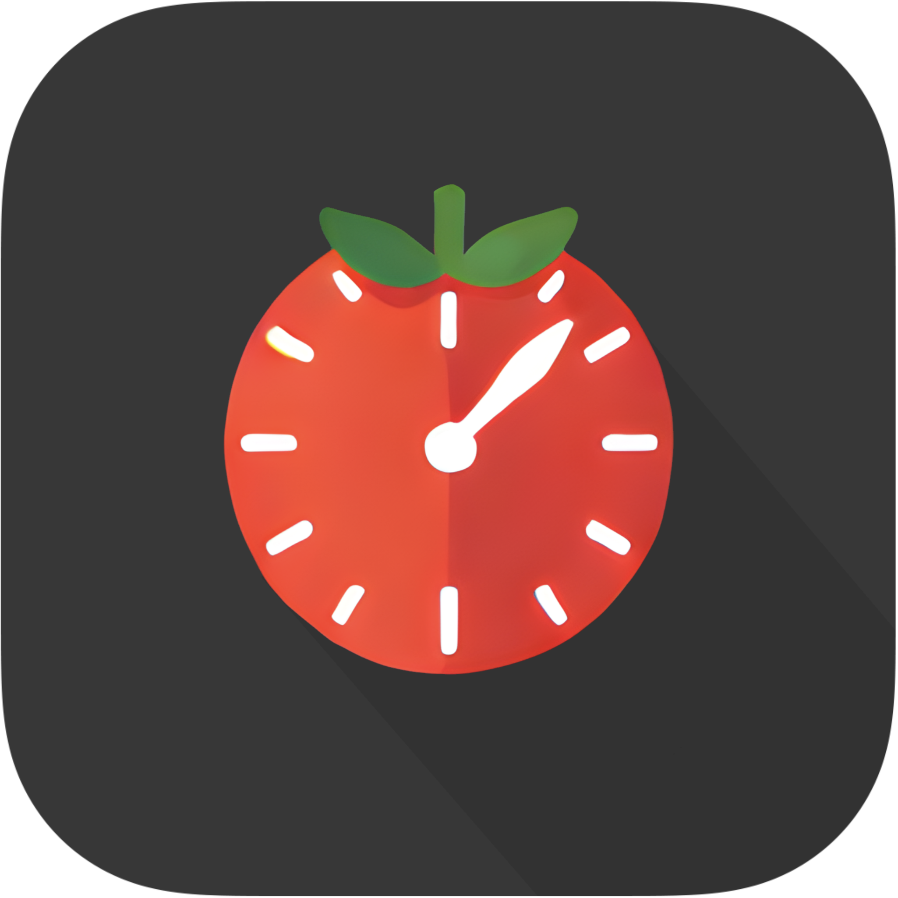
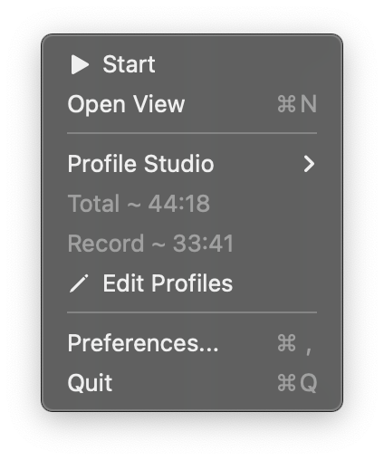

# FlowTime

An app for use the FlowTime technique in macOS, usefull to use the pomodoro timer without break your productive flow

## Usage

Download from the releases of this repo and drag the `*.app` to Application folder

When open you can use the app from the menu bar on macos, you can start the timer and relax when you are done, this will give you 1 second every 5

Example: you worked for 50 minutes, you can relax for 10

You can also create different profiles for keeping track of the type of work

# Contribute

You are free to contribute to the repo in any way
